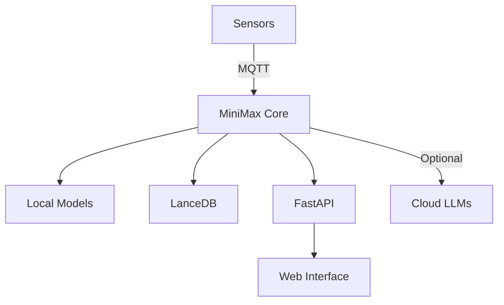

# MiniMax 🤖

> An open-source droid built to accelerate research and engineering tasks through intelligent experimentation and rapid prototyping.

[](https://www.python.org/downloads/)
[](https://opensource.org/licenses/MIT)
[](https://fastapi.tiangolo.com)

---

## 🚀 Quick Start

Get MiniMax running in under 2 minutes:

```bash
# Install for your platform
uv pip install ".[macos]"    # For macOS

# Start MiniMax
minimax start
```

That's it! 🎉

**Note**
Other platforms coming soon...
- Jetson nano
- Windows

---

## 📖 Table of Contents

- [Usage](#-usage)
- [Features](#-features)  
- [Installation](#-installation)
- [Getting Started](#-getting-started)
- [Development](#-development)
- [Testing](#-testing)
- [Architecture](#-architecture)
- [Outcomes](#-outcomes)
- [Roadmap](#-roadmap)
- [Contributing](#-contributing)
- [License](#-license)

---

## 🎯 Usage

MiniMax is a research and engineering assistant, bridging the gap between software and the physical world. This repo is intended to be a base prototyping and research setup for sensor data collection, Exploratory Data Analysis, model development, inference on edge, and intelligent analysis for a variety of use cases. It is not intended for production, just a lower friction env for prototyping and research. There's an offline mode that opperates without wifi, and an optional online mode that leverages more powerful LLMs.

---

## ✨ Features

- 🔌 **Offline Mode** - Works without internet connectivity
- 🌐 **Online Mode** - Optional integration with powerful LLMs
- 📊 **Data Analysis** - Built-in tools for exploratory data analysis
- 🤖 **Edge Inference** - Run models directly on edge devices
- 🎤 **Audio Processing** - Voice interaction capabilities
- 📡 **MQTT Integration** - Sensor data collection and device control
- 🗄️ **Vector Database** - LanceDB for efficient data storage
- ⚡ **FastAPI Backend** - High-performance API server

---

## 📦 Installation

### Prerequisites

- **Python** 3.11.10 or higher
- **Pip** 24.2 or higher  
- **UV** 0.7.13 or higher

### Install MiniMax

Install Dependancies for your given platform:
```bash
uv pip install ".[macos]"
```

### Environment Setup (Optional)

For online mode capabilities, configure your environment:

1. Create a `.env` file:
   ```bash
   touch .env
   ```

2. Add your API keys:
   ```bash
   OPENAI_API_KEY=your_openai_api_key_here
   # Add other API keys as needed
   ```

---

## 🚀 Getting Started

### CLI Usage

#### Start MiniMax
```bash
minimax start
```

#### Start with custom router file
```bash
minimax start --init_file "./your_router_file.csv"
```

#### Run without installing CLI
```bash
python minimax/cli.py start
```

### FastAPI Server

Start the development server:

```bash
uv run fastapi dev app/main.py
```

The API will be available at `http://localhost:8000`

---

## 🛠️ Development

### Code Formatting

This project uses [Black](https://github.com/psf/black) for code formatting:

```bash
black .
```

### Project Structure

```
mini-max/
├── app/           # FastAPI application
├── services/       # Core MiniMax modules
├── tests/         # Test suite
└── README.md      # You are here!
```

---

## 🧪 Testing

Run the test suite:

```bash
uv run pytest tests
```

---

## 🏗️ Architecture

MiniMax is built with a modular architecture designed for flexibility and scalability:

### Core Components

- **🔧 Jetson Orin** - Hardware platform for hosting the droid
- **⚡ FastAPI** - REST API for inference and control
- **🗄️ LanceDB** - Vector database for offline mode and data storage
- **📡 MQTT** - Message queuing for sensor/effector communication
- **🤖 Edge Models** - Local audio and NLP processing
- **🌐 Optional Online Mode** - Integration with cloud-based LLMs

### Data Flow



---

## 🎯 Outcomes

1. **Offline Smart Speaker** - Voice-controlled assistant that works without internet
2. **Intelligent Analysis** - Leverage LLMs for wholistic analysis and chat capabilities with the droid

---

## 🗺️ Roadmap

- [x] **Sensor Data Collection** - Gather data from various sensors
- [ ] **Exploratory Data Analysis** - Built-in tools for data exploration
- [ ] **Model Development Experiments** - Framework for ML experimentation  
- [ ] **Frontend UI Prototyping** - Rapid UI development tools
- [ ] **Lightweight Model Serving** - Efficient model deployment API
- [ ] **Sensor & Effector Integration** - Hardware prototyping capabilities

---

## 🤝 Contributing

We welcome contributions! Please see our [Contributing Guidelines](CONTRIBUTING.md) for details.

### Quick Contribution Steps

1. Fork the repository
2. Create a feature branch (`git checkout -b feature/amazing-feature`)
3. Commit your changes (`git commit -m 'Add amazing feature'`)
4. Push to the branch (`git push origin feature/amazing-feature`)
5. Open a Pull Request

---

## 📄 License

This project is licensed under the MIT License - see the [LICENSE](LICENSE) file for details.

---

## 💬 Support

- 📧 **Email**: [Contact us](mailto:support@minimax.com)
- 💬 **Discord**: [Join our community](https://discord.gg/minimax)
- 🐛 **Issues**: [Report bugs](https://github.com/your-org/mini-max/issues)

---

<div align="center">

**⭐ Star this repo if you find it helpful!**

Made with ❤️ by the MiniMax team

</div>